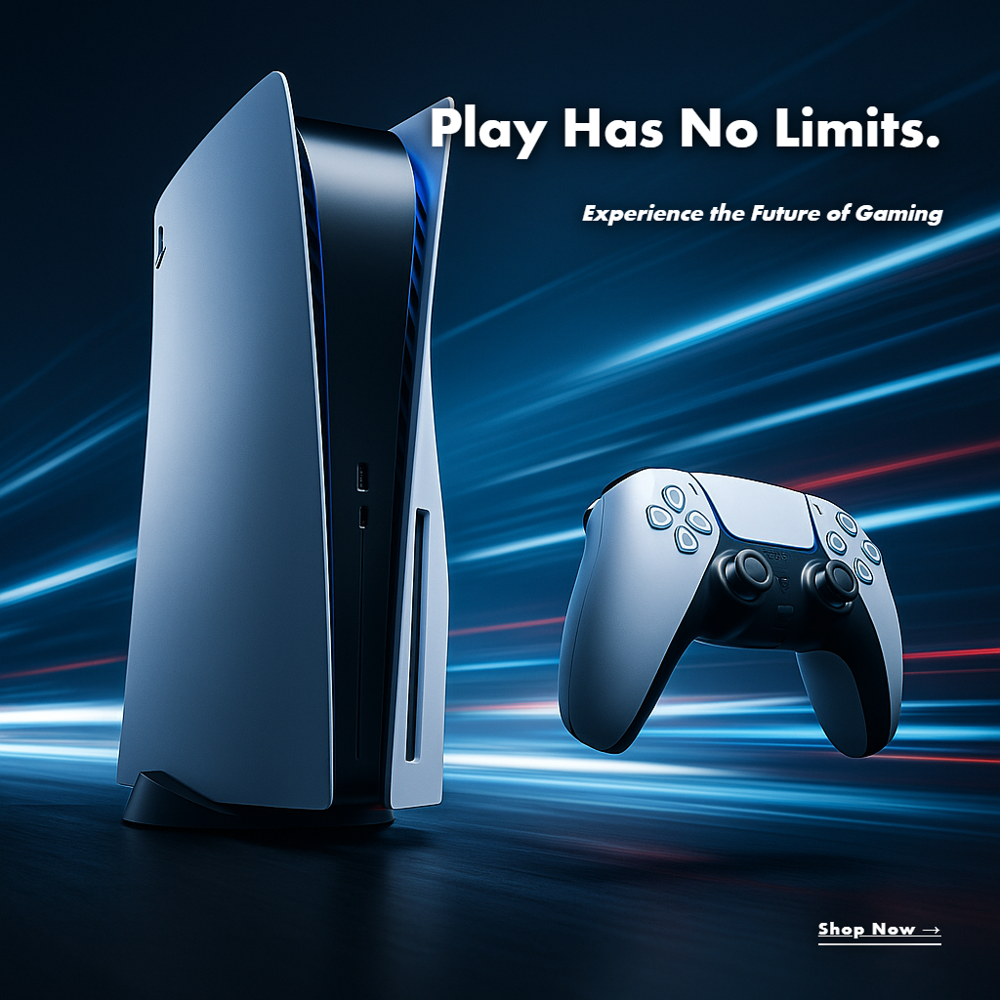
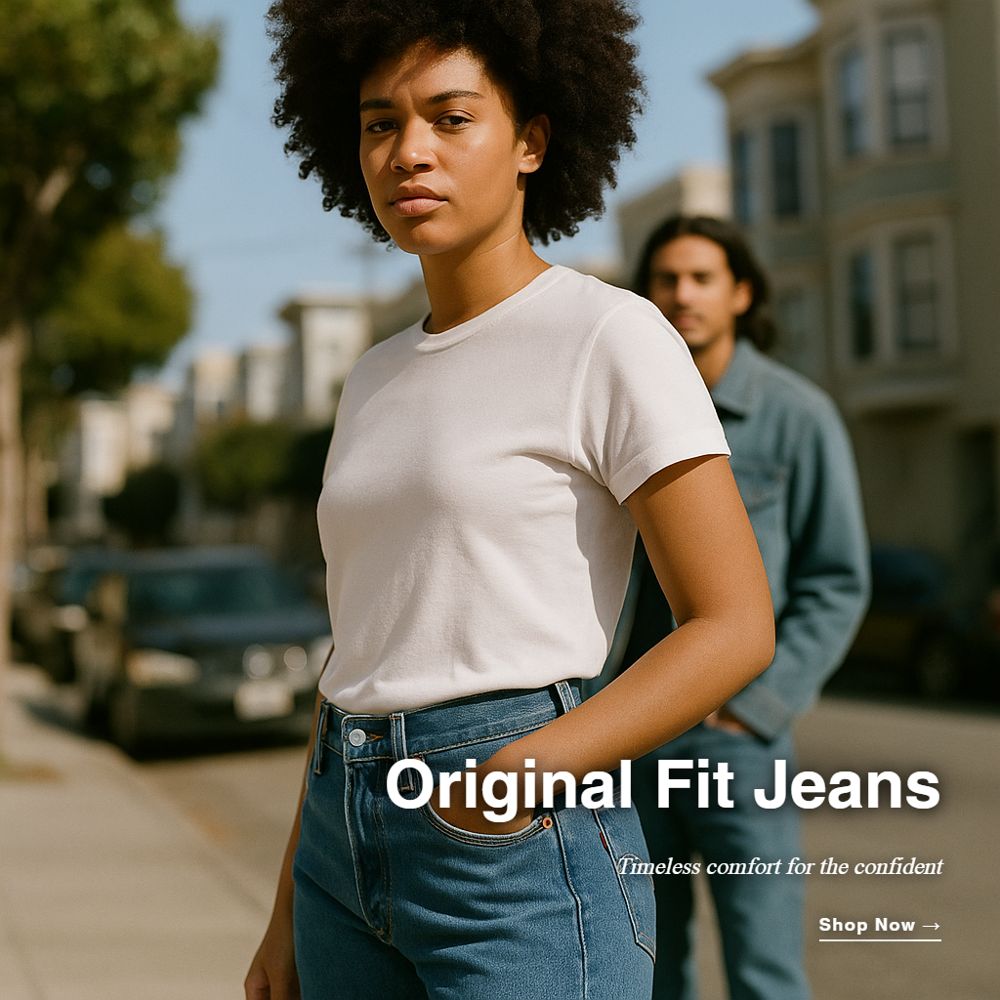
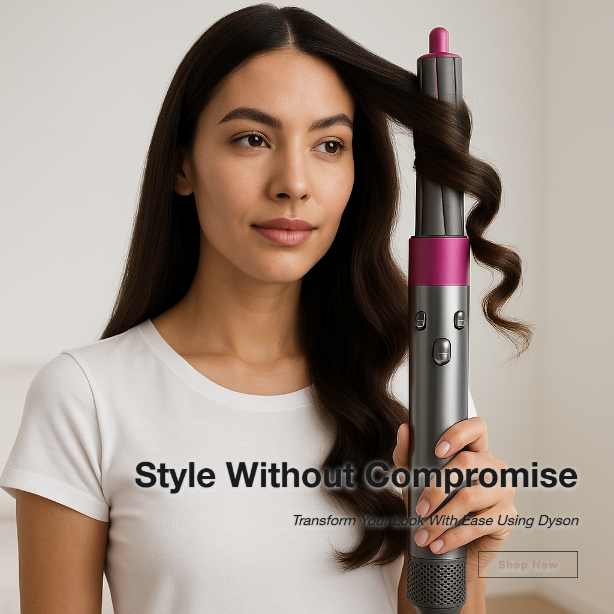

# AdCraft Pro

**A two-model AI pipeline that generates production-ready ad creatives — from creative brief to final image — in ~20 seconds.**

Fine-tuned gpt-4.1-mini writes the creative brief -> GPT-4o produces copy + HTML/CSS layout -> gpt-image-1 generates the product image -> Playwright renders typography -> production-ready ad.

---

## Sample Output

<p align="center">


</p>
<p align="center">


</p>
<p align="center">


</p>

*Each ad above was generated end-to-end by the pipeline — no manual editing, no templates. Typography, layout, colors, and copy are all AI-generated and dynamically adapted per brand.*

---

## How It Works

```
User Input (brand, product, tone, style)
          |
          v
+-------------------------------------+
|  Fine-tuned gpt-4.1-mini            |  Trained on 421 real ad examples
|  Outputs: tone, visual style,       |  SFT + DPO on 17 preference pairs
|  typography, colors, technique,     |
|  target market, competitors         |
+------------------+------------------+
                   | Creative Brief
                   v
+-------------------------------------+
|  GPT-4o                             |  Takes creative brief as context
|  Outputs: headline, subheadline,    |  Writes actual HTML/CSS for the
|  body, CTA + complete HTML/CSS      |  typography overlay
|  overlay document                   |
+------------------+------------------+
                   | Ad Copy + HTML/CSS
                   v
+------------------+------------------+
|            |                        |
v            v                        |
gpt-image-1  Playwright               |
HD image     renders HTML/CSS         |
(no text)    to transparent PNG       |
|            |                        |
v            v                        |
+-------------------------------------+
|  Pillow composites overlay          |
|  onto gpt-image-1 base image        |
|  -> Final production-ready ad       |
+-------------------------------------+
```

**Why two models?** The fine-tuned model learned *what works* from real ad data — which tones, visual styles, and techniques perform best for different product categories. GPT-4o is better at *executing* — writing polished copy and pixel-perfect HTML/CSS. Splitting the roles produces better results than either model alone.

---

## Key Engineering Decisions

| Decision | Why |
|----------|-----|
| **HTML/CSS for typography** (not Pillow) | CSS natively handles kerning, Google Fonts, gradients, backdrop-filter, text-shadow — producing agency-quality text that Pillow's bitmap rendering cannot match |
| **Fine-tuned gpt-4.1-mini** (not vanilla GPT) | Trained on 421 real ad examples to learn brand-appropriate creative direction — tone/style combinations that work for luxury vs streetwear vs food products |
| **DPO fine-tuning** on preference pairs | 17 preference pairs (avg gap 10.4 pts) from A/B testing shifted the model toward briefs that produce higher-quality ads — +5.0 pts mean composite score over SFT |
| **Two-model pipeline** (not single model) | Creative direction (what to make) separated from execution (how to make it) — mirrors how real agencies work with creative directors + designers |
| **Playwright headless Chromium** (not ImageMagick/Cairo) | Full browser rendering engine means CSS features like backdrop-filter, flex layout, and @font-face work exactly as designed |
| **Dynamic layout via GPT-4o CSS** (not hardcoded templates) | Every ad gets a unique HTML/CSS document — no two ads use the same template. Layout, fonts, colors, and CTA style are all generated per-brand |

---

## Model Training

The creative brief model was trained in two stages on gpt-4.1-mini:

| Stage | Details |
|-------|---------|
| **SFT** | 421 real ad examples, 3 epochs — `ft:gpt-4.1-mini-2025-04-14:shreyansh::DIb8s5h2` |
| **DPO** | 17 preference pairs from automated A/B testing (avg score gap 10.4 pts, beta=0.1) — `ft:gpt-4.1-mini-2025-04-14:shreyansh::DIdMhrba` |

Migrated from deprecated `ft:gpt-4o-mini-2024-07-18` — gpt-4.1-mini has a later deprecation date and supports DPO fine-tuning (gpt-4o-mini does not).

---

## Evaluation Results

Three-way evaluation across 10 diverse products (Rolex, Nike, Apple, Chanel, Oatly, Tesla, Sony, Dyson, Levi's, Nespresso). Scored on 5 WCAG-based metrics via `AdQualityScorer`.

### Composite Score (0-100)

| Model | Mean +/- Std | Min | Max | Success Rate |
|-------|-------------|-----|-----|-------------|
| Baseline (gpt-4.1-mini, no FT) | 71.5 +/- 6.6 | 64.2 | 85.1 | 8/10* |
| SFT | 66.4 +/- 10.7 | 48.0 | 86.1 | 10/10 |
| **SFT+DPO (production)** | **71.4 +/- 7.0** | **62.7** | **84.0** | **10/10** |

*Baseline 2/10 failures: raw model returned dict/list for `visual_style` — demonstrates why SFT matters for structured output reliability.

### Per-Metric Breakdown

| Metric | Baseline | SFT | SFT+DPO |
|--------|---------|-----|---------|
| Readability (WCAG contrast) | 74.8 | 62.8 | 70.8 |
| Placement | 58.8 | 49.9 | 60.4 |
| Composition | 67.8 | 71.1 | 68.2 |
| Color harmony | 98.8 | 100.0 | 99.7 |
| Copy quality | 72.8 | 72.8 | **76.7** |

### Statistical Significance (Welch's t-test)

| Comparison | Delta Score | p-value | |
|-----------|------------|---------|--|
| Baseline vs SFT | -5.1 | 0.26 | n.s. |
| SFT vs SFT+DPO | **+5.0** | 0.26 | n.s. |
| Baseline vs SFT+DPO | -0.1 | 0.99 | n.s. |

*n.s. at n=10 — larger eval set needed for significance. DPO's +5.0 pt gain over SFT and improved copy score (72.8 -> 76.7) are directionally consistent with preference data.*

### Portfolio Scores (SFT+DPO model)

| Product | Score | Grade | Headline |
|---------|-------|-------|---------|
| Sony PlayStation 5 Pro | 82.7 | A- | "Play Has No Limits." |
| Rolex Submariner | 78.7 | B+ | "Legendary Precision" |
| Tesla Model S Plaid | 74.5 | B | "Beyond Ludicrous" |
| Levi's 501 | 73.6 | B | "Original Fit Jeans" |
| Dyson Airwrap | 68.3 | B- | "Style Without Compromise" |
| Nike Air Jordan 1 | 66.5 | B- | "DEFY THE ORDINARY" |

---

## Metrics

| Metric | Value |
|--------|-------|
| Fine-tuning data | 421 real ad examples across 12+ brands |
| SFT base model | gpt-4.1-mini-2025-04-14, 3 epochs |
| DPO preference pairs | 17 pairs (avg score gap 10.4 pts, beta=0.1) |
| Models per generation | 3 (fine-tuned + GPT-4o + gpt-image-1) |
| Generation time | ~20 seconds end-to-end |
| Cost per ad | ~$0.12-0.15 |
| Typography | HTML/CSS rendered via Playwright (Google Fonts, CSS shadows, gradients, flexbox) |
| Layout variety | 6+ styles dynamically generated per brand |
| CTA styles | 5+ (pill, square, underline, block, ghost) |
| Font library | 672 fonts across 6 categories |
| Industries | 8+ verticals (luxury, tech, fashion, food, beauty, automotive, gaming, health) |
| Tests | 21 automated (pytest) |
| Deployment | Docker + docker-compose |

---

## Tech Stack

**AI/ML:** OpenAI GPT-4o, gpt-image-1, Fine-tuned gpt-4.1-mini (SFT + DPO), OpenAI fine-tuning API
**Backend:** Python 3.14, FastAPI, Uvicorn
**Frontend:** Streamlit (custom dark theme)
**Typography:** Playwright headless Chromium, Google Fonts, HTML/CSS rendering
**Image Processing:** Pillow (compositing), NumPy (color extraction)
**Data:** 421-example fine-tuning dataset + 17 DPO preference pairs
**Infrastructure:** Docker, pytest, RotatingFileHandler logging

---

## Quick Start

```bash
git clone https://github.com/shreyansh1719/content-engine.git
cd content-engine
python -m venv venv
venv\Scripts\activate        # Windows
pip install -r requirements.txt
playwright install chromium
```

Create `.env`:
```
OPENAI_API_KEY=sk-...
FINE_TUNED_MODEL_ID=ft:gpt-4.1-mini-2025-04-14:shreyansh::DIdMhrba
```

Run:
```bash
run.bat                       # Starts API + Frontend (Windows)
# Or manually:
uvicorn api:app --port 8000   # Terminal 1
streamlit run frontend_app.py # Terminal 2
```

Open `http://localhost:8501` -> fill in brand + product -> Generate.

---

## API

```bash
# Generate an ad
curl -X POST http://localhost:8000/generate_ad \
  -H "Content-Type: application/json" \
  -d '{"product_name":"AirPods Pro","brand_name":"Apple","industry":"Technology","tone":"Premium","visual_style":"Minimalist","platform":"Instagram","principle":"Emotional","product_description":"","key_benefit":""}'

# Health check
curl http://localhost:8000/health

# Submit feedback
curl -X POST http://localhost:8000/submit_feedback \
  -H "Content-Type: application/json" \
  -d '{"ad_id":"...","rating":5,"strengths":"Great headline"}'
```

---

## Project Structure

```
content-engine/
+-- api.py                          # FastAPI backend
+-- frontend_app.py                 # Streamlit premium UI
+-- ad_generator/
|   +-- generator.py                # Two-model pipeline orchestrator
|   +-- image_maker.py              # gpt-image-1 image generation
|   +-- quality_scorer.py           # 5-metric WCAG-based ad scoring
|   +-- ab_testing.py               # A/B variant testing engine
|   +-- feedback_loop.py            # Preference pair collection
|   +-- dpo_dataset_builder.py      # OpenAI DPO format builder
|   +-- model_evaluator.py          # Statistical model comparison
|   +-- prompts.py                  # Single source of truth for prompts
|   +-- product_integration.py      # Background removal + compositing
|   +-- analytics.py                # Industry pattern analysis
|   +-- typography/
|       +-- html_renderer.py        # Playwright HTML/CSS -> PNG renderer
|       +-- typography_system.py    # Legacy Pillow renderer (mock mode)
|       +-- ... (10 modules)
+-- scripts/
|   +-- retrain_sft_model.py        # SFT training (421 examples -> gpt-4.1-mini)
|   +-- generate_preference_data.py # Batch A/B testing -> preference pairs
|   +-- run_dpo_training.py         # DPO fine-tuning on preference pairs
|   +-- run_evaluation.py           # Three-way statistical evaluation
|   +-- generate_portfolio.py       # Portfolio generation with winning model
+-- fine_tuning_dataset_v2.jsonl    # 421-example SFT training dataset
+-- data/
|   +-- feedback_loop/              # 17 preference pairs from A/B testing
|   +-- dpo_training_dataset.jsonl  # DPO training data (OpenAI format)
|   +-- evaluations/                # Three-way comparison results
+-- tests/                          # 21 pytest tests
+-- Dockerfile + docker-compose.yml
+-- output/images/final/            # Generated ads
```

---

## What's Next

- [ ] Collect more preference pairs -> retrain DPO with larger dataset (50+ pairs for significance)
- [ ] Swap scoring from image analysis -> real engagement metrics (CTR, conversion)
- [ ] Product image upload -> background removal -> AI scene generation (endpoint exists)
- [ ] Video ad generation (MoviePy pipeline exists, needs integration)
- [ ] Flux image model (better "no text" compliance than gpt-image-1)
