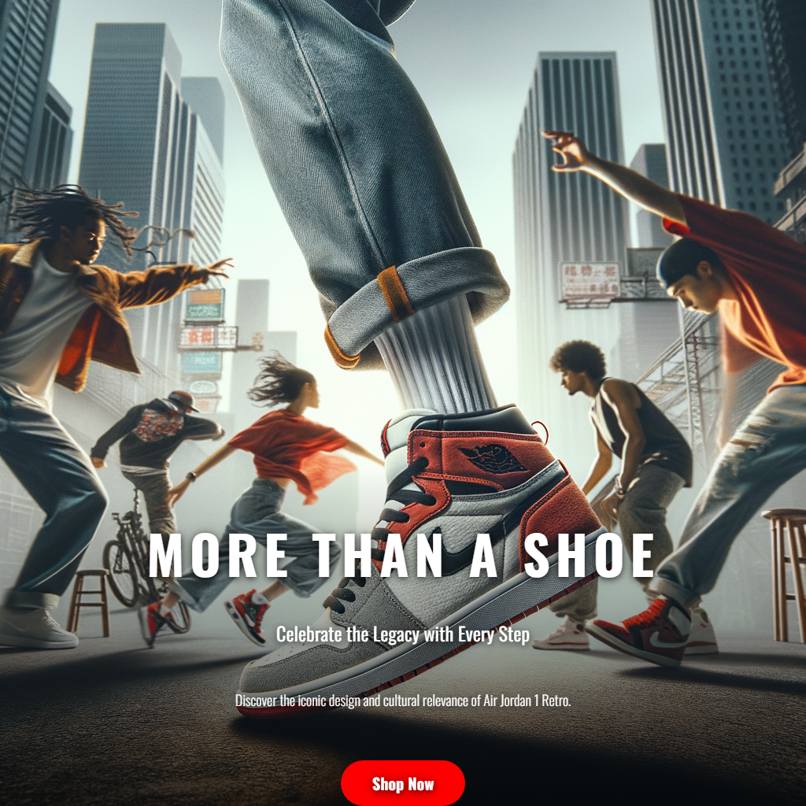
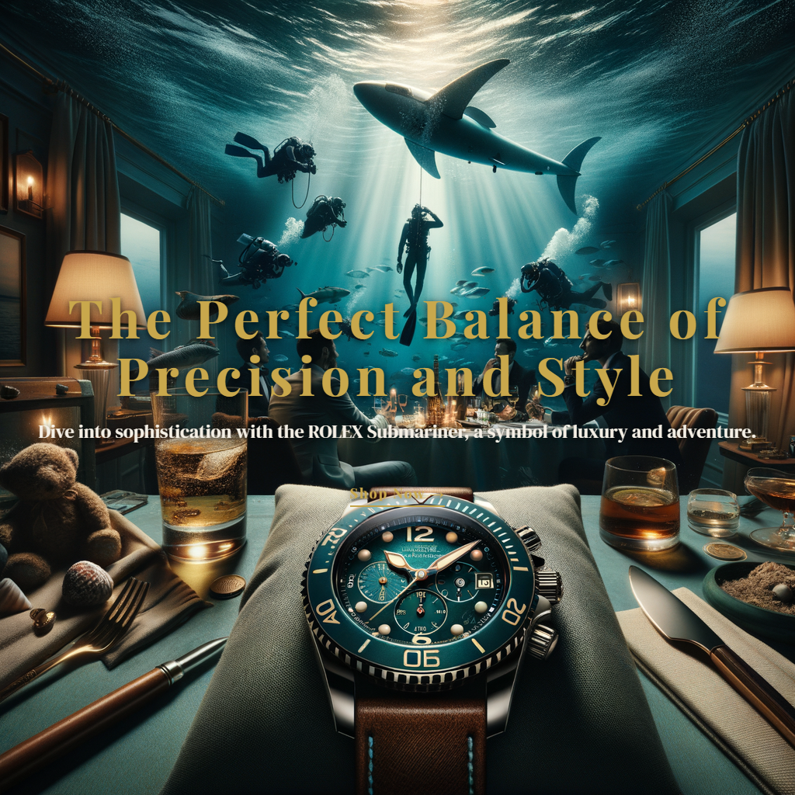
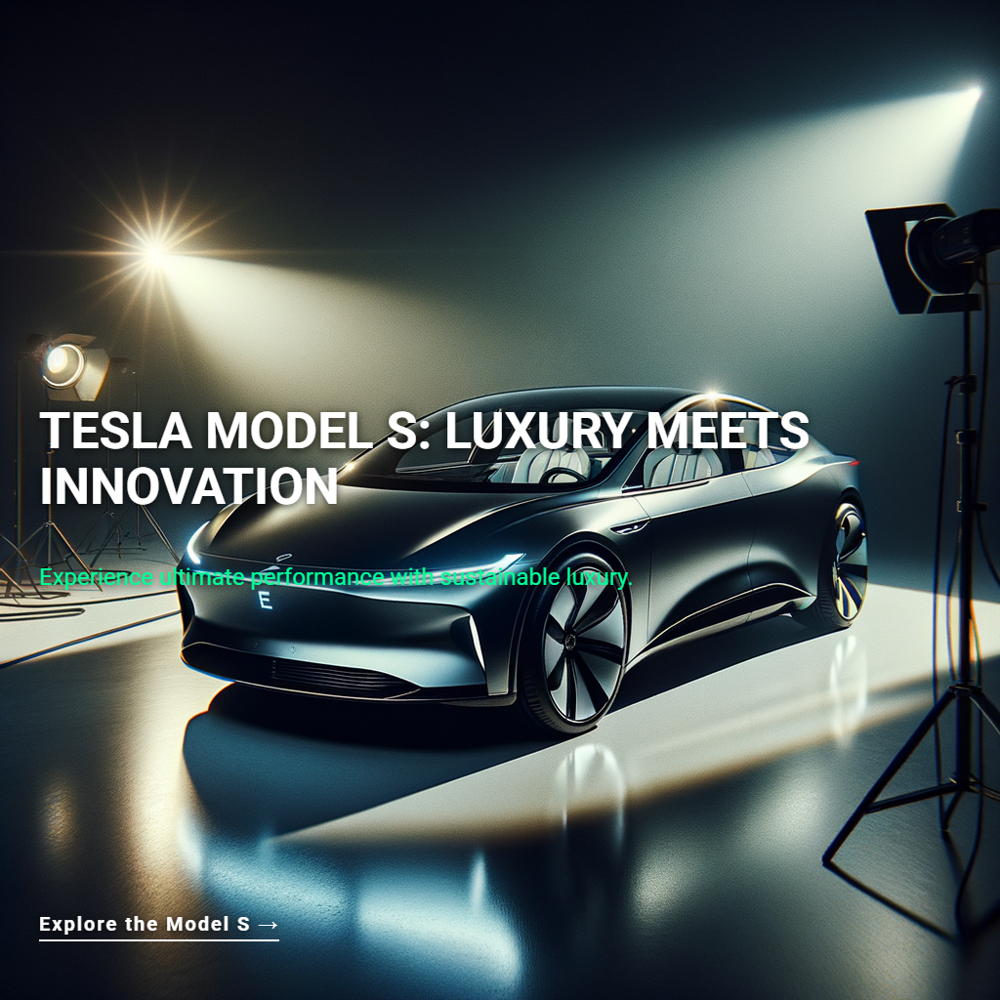
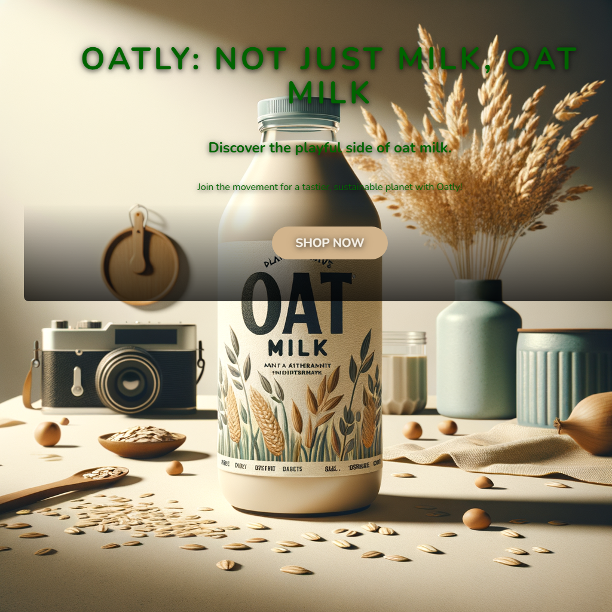

# AdCraft Pro

**A two-model AI pipeline that generates production-ready ad creatives — from creative brief to final image — in 20 seconds.**

Fine-tuned gpt-4o-mini (421 examples) writes the creative brief → GPT-4o produces copy + HTML/CSS layout → DALL-E 3 generates the product image → Playwright renders typography → production-ready ad.

---

## Sample Output

<p align="center">


</p>
<p align="center">


</p>
<p align="center">


</p>

*Each ad above was generated end-to-end by the pipeline — no manual editing, no templates. Typography, layout, colors, and copy are all AI-generated and dynamically adapted per brand.*

---

## How It Works

```
User Input (brand, product, tone, style)
          │
          ▼
┌─────────────────────────────────────┐
│  Fine-tuned gpt-4o-mini             │  Trained on 421 real ad examples
│  Outputs: tone, visual style,       │  (practical.jsonl + made_to_stick)
│  typography, colors, technique,     │
│  target market, competitors         │
└──────────────┬──────────────────────┘
               │ Creative Brief
               ▼
┌─────────────────────────────────────┐
│  GPT-4o                             │  Takes creative brief as context
│  Outputs: headline, subheadline,    │  Writes actual HTML/CSS for the
│  body, CTA + complete HTML/CSS      │  typography overlay
│  overlay document                   │
└──────────────┬──────────────────────┘
               │ Ad Copy + HTML/CSS
               ▼
┌──────────────┴──────────────────────┐
│            │                        │
▼            ▼                        │
DALL-E 3     Playwright               │
HD image     renders HTML/CSS         │
(no text)    to transparent PNG       │
│            │                        │
▼            ▼                        │
┌─────────────────────────────────────┐
│  Pillow composites overlay          │
│  onto DALL-E image                  │
│  → Final production-ready ad        │
└─────────────────────────────────────┘
```

**Why two models?** The fine-tuned model learned *what works* from real ad data — which tones, visual styles, and techniques perform best for different product categories. GPT-4o is better at *executing* — writing polished copy and pixel-perfect HTML/CSS. Splitting the roles produces better results than either model alone.

---

## Key Engineering Decisions

| Decision | Why |
|----------|-----|
| **HTML/CSS for typography** (not Pillow) | CSS natively handles kerning, Google Fonts, gradients, backdrop-filter, text-shadow — producing agency-quality text that Pillow's bitmap rendering cannot match |
| **Fine-tuned gpt-4o-mini** (not vanilla GPT) | Trained on 421 real ad examples to learn brand-appropriate creative direction — tone/style combinations that work for luxury vs streetwear vs food products |
| **Two-model pipeline** (not single model) | Creative direction (what to make) separated from execution (how to make it) — mirrors how real agencies work with creative directors + designers |
| **Playwright headless Chromium** (not ImageMagick/Cairo) | Full browser rendering engine means CSS features like backdrop-filter, flex layout, and @font-face work exactly as designed |
| **Dynamic layout via GPT-4o CSS** (not hardcoded templates) | Every ad gets a unique HTML/CSS document — no two ads use the same template. Layout, fonts, colors, and CTA style are all generated per-brand |

---

## Metrics

| Metric | Value |
|--------|-------|
| Fine-tuning data | 421 real ad examples across 12+ brands |
| Base model | gpt-4o-mini-2024-07-18, 3 epochs |
| Models per generation | 3 (fine-tuned + GPT-4o + DALL-E 3 HD) |
| Generation time | ~20 seconds end-to-end |
| Cost per ad | ~$0.12–0.15 |
| Typography | HTML/CSS rendered via Playwright (Google Fonts, CSS shadows, gradients, flexbox) |
| Layout variety | 6+ styles dynamically generated per brand |
| CTA styles | 5+ (pill, square, underline, block, ghost) |
| Font library | 672 fonts across 6 categories |
| Industries | 8+ verticals (luxury, tech, fashion, food, beauty, automotive, gaming, health) |
| Tests | 21 automated (pytest) |
| Deployment | Docker + docker-compose |

---

## Tech Stack

**AI/ML:** OpenAI GPT-4o, DALL-E 3, Fine-tuned gpt-4o-mini, OpenAI fine-tuning API
**Backend:** Python 3.14, FastAPI, Uvicorn
**Frontend:** Streamlit (custom dark theme)
**Typography:** Playwright headless Chromium, Google Fonts, HTML/CSS rendering
**Image Processing:** Pillow (compositing), NumPy (color extraction)
**Data:** 421-example fine-tuning dataset (practical.jsonl + made_to_stick)
**Infrastructure:** Docker, pytest, RotatingFileHandler logging

---

## Quick Start

```bash
git clone https://github.com/shreyansh1719/content-engine.git
cd content-engine
python -m venv venv
venv\Scripts\activate        # Windows
pip install -r requirements.txt
playwright install chromium
```

Create `.env`:
```
OPENAI_API_KEY=sk-...
FINE_TUNED_MODEL_ID=ft:gpt-4o-mini-2024-07-18:shreyansh::DHRbE3oW
```

Run:
```bash
run.bat                       # Starts API + Frontend (Windows)
# Or manually:
uvicorn api:app --port 8000   # Terminal 1
streamlit run frontend_app.py # Terminal 2
```

Open `http://localhost:8501` → fill in brand + product → Generate.

---

## API

```bash
# Generate an ad
curl -X POST http://localhost:8000/generate_ad \
  -H "Content-Type: application/json" \
  -d '{"product_name":"AirPods Pro","brand_name":"Apple","industry":"Technology","tone":"Premium","visual_style":"Minimalist","platform":"Instagram","principle":"Emotional","product_description":"","key_benefit":""}'

# Health check
curl http://localhost:8000/health

# Submit feedback
curl -X POST http://localhost:8000/submit_feedback \
  -H "Content-Type: application/json" \
  -d '{"ad_id":"...","rating":5,"strengths":"Great headline"}'
```

---

## Project Structure

```
content-engine/
├── api.py                          # FastAPI backend
├── frontend_app.py                 # Streamlit premium UI
├── ad_generator/
│   ├── generator.py                # Two-model pipeline orchestrator
│   ├── image_maker.py              # DALL-E 3 image generation
│   ├── product_integration.py      # Background removal + compositing
│   ├── analytics.py                # Industry pattern analysis
│   └── typography/
│       ├── html_renderer.py        # Playwright HTML/CSS → PNG renderer
│       ├── typography_system.py    # Legacy Pillow renderer (mock mode)
│       └── ... (10 modules)
├── improved_ad_generator.py        # A/B testing + fine-tuned model variants
├── fine_tuning_dataset_v2.jsonl    # 421-example training dataset
├── tests/                          # 21 pytest tests
├── Dockerfile + docker-compose.yml
└── output/images/final/            # Generated ads
```

---

## What's Next

- [ ] Swap DALL-E 3 for Flux (better "no text" compliance, cheaper)
- [ ] Collect user feedback → retrain fine-tuned model (self-improving loop)
- [ ] Product image upload → background removal → AI scene generation
- [ ] Video ad generation (MoviePy pipeline exists, needs integration)
- [ ] A/B testing with real engagement metrics
