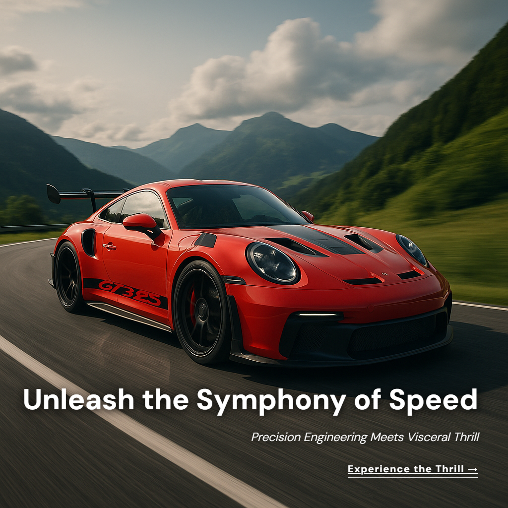
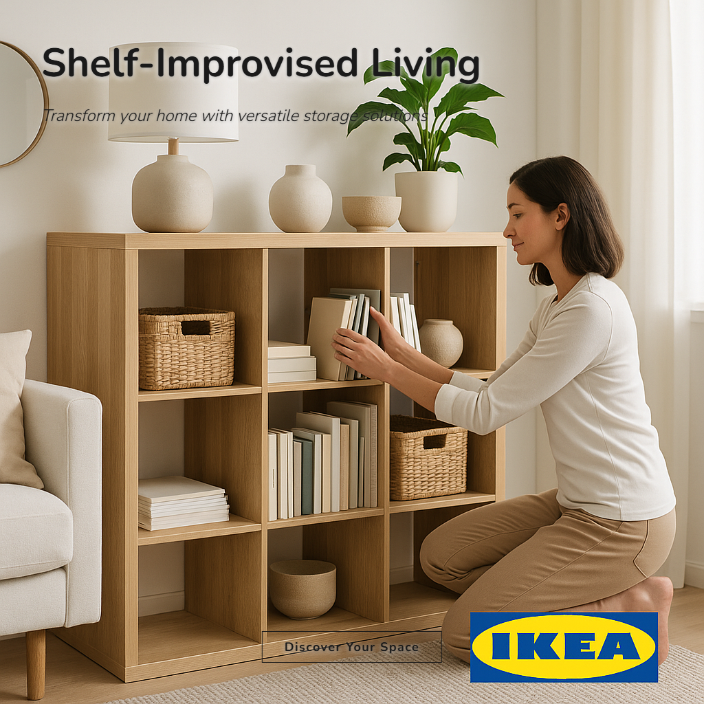

6 AdCraft Pro

**A two-model AI pipeline that generates production-ready ad creatives — from creative brief to final image — in ~20 seconds.**

Fine-tuned gpt-4.1-mini writes the creative brief -> GPT-4o produces copy + HTML/CSS layout -> gpt-image-1 generates the product image -> Playwright renders typography -> production-ready ad.

---

## Sample Output

<p align="center">


</p>
<p align="center">


</p>
<p align="center">


</p>

*Each ad above was generated end-to-end by the pipeline — no manual editing, no templates. Typography, layout, colors, and copy are all AI-generated and dynamically adapted per brand.*

---

## How It Works

```
User Input (brand, product, tone, style)
          |
          v
+-------------------------------------+
|  Fine-tuned gpt-4.1-mini            |  Trained on 421 real ad examples
|  Outputs: tone, visual style,       |  SFT + DPO on 34 preference pairs
|  typography, colors, technique,     |
|  target market, competitors         |
+------------------+------------------+
                   | Creative Brief
                   v
+-------------------------------------+
|  GPT-4o                             |  Takes creative brief as context
|  Outputs: headline, subheadline,    |  Writes actual HTML/CSS for the
|  body, CTA + complete HTML/CSS      |  typography overlay
|  overlay document                   |
+------------------+------------------+
                   | Ad Copy + HTML/CSS
                   v
+------------------+------------------+
|            |                        |
v            v                        |
gpt-image-1  Playwright               |
HD image     renders HTML/CSS         |
(no text)    to transparent PNG       |
|            |                        |
v            v                        |
+-------------------------------------+
|  Pillow composites overlay          |
|  onto gpt-image-1 base image        |
|  -> Final production-ready ad       |
+-------------------------------------+
```

**Why two models?** The fine-tuned model learned *what works* from real ad data — which tones, visual styles, and techniques perform best for different product categories. GPT-4o is better at *executing* — writing polished copy and pixel-perfect HTML/CSS. Splitting the roles produces better results than either model alone.

---

## Key Engineering Decisions

| Decision | Why |
|----------|-----|
| **HTML/CSS for typography** (not Pillow) | CSS natively handles kerning, Google Fonts, gradients, backdrop-filter, text-shadow — producing agency-quality text that Pillow's bitmap rendering cannot match |
| **Fine-tuned gpt-4.1-mini** (not vanilla GPT) | Trained on 118 high-quality seed-derived examples to learn brand-appropriate creative direction — tone/style combinations that work for luxury vs streetwear vs food products |
| **DPO fine-tuning** on preference pairs | 34 preference pairs (avg gap 13.2 pts) from A/B testing on 20 products x 3 variants shifted the model toward briefs that produce higher-quality ads |
| **Two-model pipeline** (not single model) | Creative direction (what to make) separated from execution (how to make it) — mirrors how real agencies work with creative directors + designers |
| **Playwright headless Chromium** (not ImageMagick/Cairo) | Full browser rendering engine means CSS features like backdrop-filter, flex layout, and @font-face work exactly as designed |
| **Dynamic layout via GPT-4o CSS** (not hardcoded templates) | Every ad gets a unique HTML/CSS document — no two ads use the same template. Layout, fonts, colors, and CTA style are all generated per-brand |

---

## Model Training

The creative brief model was trained in two stages on gpt-4.1-mini:

| Stage | Details |
|-------|---------|
| **SFT** | 118 high-quality seed-derived examples, 3 epochs — `ft:gpt-4.1-mini-2025-04-14:shreyansh::DKlvOMcG` |
| **DPO** | 34 preference pairs from 20 products x 3 variants (avg score gap 13.2 pts, beta=0.1) — `ft:gpt-4.1-mini-2025-04-14:shreyansh::DKoaHRaE` |

Migrated from deprecated `ft:gpt-4o-mini-2024-07-18` — gpt-4.1-mini has a later deprecation date and supports DPO fine-tuning (gpt-4o-mini does not).

---

## Evaluation Results

Three-way evaluation expanded to 20 diverse products. Scored on 5 WCAG-based metrics via `AdQualityScorer`. (v3 run: SFT+DPO evaluation cut short by billing limit; 18/20 products incomplete for that model.)

### Composite Score (0-100) — v3 Dataset

| Model | Mean +/- Std | Min | Max | Success Rate |
|-------|-------------|-----|-----|-------------|
| Baseline (gpt-4.1-mini, no FT) | 68.2 +/- 5.2 | 59.9 | 77.5 | 15/20* |
| **SFT v3 (production)** | **67.4 +/- 9.9** | **46.1** | **86.9** | **20/20** |

*Baseline 5/20 failures: billing limit during image generation — demonstrates why SFT matters for structured output reliability. SFT achieves 100% success rate.

### Per-Metric Breakdown (Baseline vs SFT v3)

| Metric | Weight | Baseline | SFT v3 | Delta |
|--------|--------|---------|--------|-------|
| Readability (WCAG contrast) | 30% | 66.0 | 58.1 | -7.9 |
| Placement | 25% | 58.1 | 61.5 | +3.4 |
| Composition | 20% | 64.9 | 69.4 | +4.5 |
| Color harmony | 10% | 99.6 | 100.0 | +0.4 |
| Copy quality | 15% | 72.9 | 71.4 | -1.5 |

### Statistical Significance (Welch's t-test, Baseline vs SFT v3)

| Stat | Value |
|------|-------|
| Mean difference | -0.8 pts |
| p-value | 0.771 (n.s.) |
| 95% CI | (-5.8, +4.3) |
| Cohen's d | -0.096 (negligible) |

Models are statistically equivalent in quality. SFT's value is reliability: 100% structured output success rate vs 75% for raw baseline.

### Portfolio Scores (SFT v3 model, n=20)

| Product | Score | Grade | Headline |
|---------|-------|-------|---------|
| Sony PS5 Pro | 82.7 | A- | "Play Has No Limits." |
| Rolex Submariner | 78.7 | B+ | "Legendary Precision" |
| Porsche 911 GT3 RS | 78.1 | B+ | "Unleash the Symphony of Speed" |
| IKEA KALLAX | 76.0 | B+ | "Shelf-Improvised Living" |
| Tesla Model S | 74.5 | B | "Beyond Ludicrous" |
| Chanel No. 5 | 73.8 | B | "The Fifth Element of Elegance" |

---

### Creative Brief Quality Assessment (CBQA)

To isolate and measure the fine-tuned model's actual output quality independent of downstream image generation and HTML rendering, we implemented a 7-dimension, 18-sub-metric evaluation framework using GPT-4o as judge with chain-of-thought reasoning (G-Eval methodology, n=25 products).

| Model | CBQA Score | Headline | Caption | Strategy | Tone | Visual Style | CTA | Production |
|-------|-----------|----------|---------|----------|------|-------------|-----|------------|
| Baseline | 73.2 +/- 6.4 | 63.2 | 85.7 | 75.0 | 89.0 | 53.5 | 86.0 | 63.0 |
| SFT v3 | 74.1 +/- 4.4 | 68.7 | 82.1 | 74.0 | 88.0 | 42.0 | 91.0 | 79.0 |
| SFT+DPO v3 | 73.6 +/- 4.2 | 69.8 | 80.9 | 74.7 | 87.0 | 38.5 | 92.0 | 77.0 |

*Scores normalized within each dimension (raw/max x 100). SFT/DPO score higher on Headline (+6.6 pts) and Production Specs (+16 pts). Baseline scores higher on Caption Originality (+4 pts) and Visual Style (+15 pts).*

**Key finding:** All three models score statistically equivalently overall (Baseline vs SFT+DPO: delta=+0.35 pts, p=0.82, n.s.). **The fine-tuned model's primary advantage is consistency** — standard deviation drops from 6.4 (baseline) to 4.2 (SFT+DPO), meaning fewer creative failures. Fine-tuning also improves structured output reliability: 100% valid JSON vs occasional format failures from the baseline.

**Pairwise evaluation (SFT+DPO vs Baseline, n=25, 2 position swaps):**

| Dimension | DPO Win Rate | p-value |
|-----------|-------------|---------|
| Headline | 0% | n.s. |
| Visual Concept | 68.8% | 0.105 (n.s.) |
| Strategic Thinking | 0% | n.s. |
| Brand Alignment | 8% | n.s. |
| Overall | 0% | n.s. |

*Baseline dominates pairwise overall — GPT-4o judges prefer the baseline's more expansive writing style in direct comparison. This diverges from pointwise rubric scores because pairwise compares stylistic preferences rather than rubric compliance. The fine-tuned model produces tighter, more concise briefs that score well on rubric criteria but lose in stylistic head-to-head.*

**Reliability:** Pearson r=0.75 between duplicate judge runs, MAD=3.0 pts — acceptable inter-run consistency.

*CBQA evaluates the creative brief directly — headline creativity, visual scene specificity, strategic technique, brand alignment, typography, and color recommendations — without confounding from image generation quality or HTML rendering.*

---

## Metrics

| Metric | Value |
|--------|-------|
| Fine-tuning data | 118 seed-derived examples (v3, 0 validation errors) |
| SFT base model | gpt-4.1-mini-2025-04-14, 3 epochs |
| DPO preference pairs | 34 pairs from 20 products x 3 variants (avg gap 13.2 pts, beta=0.1) |
| Models per generation | 3 (fine-tuned + GPT-4o + gpt-image-1) |
| Generation time | ~20 seconds end-to-end |
| Cost per ad | ~$0.12-0.15 |
| Typography | HTML/CSS rendered via Playwright (Google Fonts, CSS shadows, gradients, flexbox) |
| Layout variety | 6+ styles dynamically generated per brand |
| CTA styles | 5+ (pill, square, underline, block, ghost) |
| Font library | 672 fonts across 6 categories |
| Industries | 8+ verticals (luxury, tech, fashion, food, beauty, automotive, gaming, health) |
| Tests | 21 automated (pytest) |
| Deployment | Docker + docker-compose |

---

## Tech Stack

**AI/ML:** OpenAI GPT-4o, gpt-image-1, Fine-tuned gpt-4.1-mini (SFT + DPO), OpenAI fine-tuning API
**Backend:** Python 3.14, FastAPI, Uvicorn
**Frontend:** Streamlit (custom dark theme)
**Typography:** Playwright headless Chromium, Google Fonts, HTML/CSS rendering
**Image Processing:** Pillow (compositing), NumPy (color extraction)
**Data:** 118-example v3 fine-tuning dataset + 34 DPO preference pairs
**Infrastructure:** Docker, pytest, RotatingFileHandler logging

---

## Quick Start

```bash
git clone https://github.com/shreyansh1719/content-engine.git
cd content-engine
python -m venv venv
venv\Scripts\activate        # Windows
pip install -r requirements.txt
playwright install chromium
```

Create `.env`:
```
OPENAI_API_KEY=sk-...
FINE_TUNED_MODEL_ID=ft:gpt-4.1-mini-2025-04-14:shreyansh::DKoaHRaE
```

Run:
```bash
run.bat                       # Starts API + Frontend (Windows)
# Or manually:
uvicorn api:app --port 8000   # Terminal 1
streamlit run frontend_app.py # Terminal 2
```

Open `http://localhost:8501` -> fill in brand + product -> Generate.

---

## API

```bash
# Generate an ad
curl -X POST http://localhost:8000/generate_ad \
  -H "Content-Type: application/json" \
  -d '{"product_name":"AirPods Pro","brand_name":"Apple","industry":"Technology","tone":"Premium","visual_style":"Minimalist","platform":"Instagram","principle":"Emotional","product_description":"","key_benefit":""}'

# Health check
curl http://localhost:8000/health

# Submit feedback
curl -X POST http://localhost:8000/submit_feedback \
  -H "Content-Type: application/json" \
  -d '{"ad_id":"...","rating":5,"strengths":"Great headline"}'
```

---

## Project Structure

```
content-engine/
+-- api.py                          # FastAPI backend
+-- frontend_app.py                 # Streamlit premium UI
+-- ad_generator/
|   +-- generator.py                # Two-model pipeline orchestrator
|   +-- image_maker.py              # gpt-image-1 image generation
|   +-- quality_scorer.py           # 5-metric WCAG-based ad scoring
|   +-- ab_testing.py               # A/B variant testing engine
|   +-- feedback_loop.py            # Preference pair collection
|   +-- dpo_dataset_builder.py      # OpenAI DPO format builder
|   +-- model_evaluator.py          # Statistical model comparison
|   +-- prompts.py                  # Single source of truth for prompts
|   +-- product_integration.py      # Background removal + compositing
|   +-- analytics.py                # Industry pattern analysis
|   +-- typography/
|       +-- html_renderer.py        # Playwright HTML/CSS -> PNG renderer
|       +-- typography_system.py    # Legacy Pillow renderer (mock mode)
|       +-- ... (10 modules)
+-- scripts/
|   +-- retrain_sft_model.py        # SFT training (118 examples -> gpt-4.1-mini)
|   +-- generate_preference_data.py # Batch A/B testing -> preference pairs
|   +-- run_dpo_training.py         # DPO fine-tuning on preference pairs
|   +-- run_evaluation.py           # Three-way statistical evaluation
|   +-- generate_portfolio.py       # Portfolio generation with winning model
+-- fine_tuning_dataset_v3.jsonl    # 118-example v3 SFT training dataset (seed-derived)
+-- data/
|   +-- feedback_loop/              # 34 preference pairs from 20-product A/B testing
|   +-- dpo_training_dataset.jsonl  # DPO training data (OpenAI format)
|   +-- evaluations/                # Three-way comparison results
+-- tests/                          # 21 pytest tests
+-- Dockerfile + docker-compose.yml
+-- output/images/final/            # Generated ads
```

---

## What's Next

- [ ] Collect more preference pairs -> retrain DPO with larger dataset (50+ pairs for significance)
- [ ] Swap scoring from image analysis -> real engagement metrics (CTR, conversion)
- [ ] Product image upload -> background removal -> AI scene generation (endpoint exists)
- [ ] Video ad generation (MoviePy pipeline exists, needs integration)
- [ ] Flux image model (better "no text" compliance than gpt-image-1)
